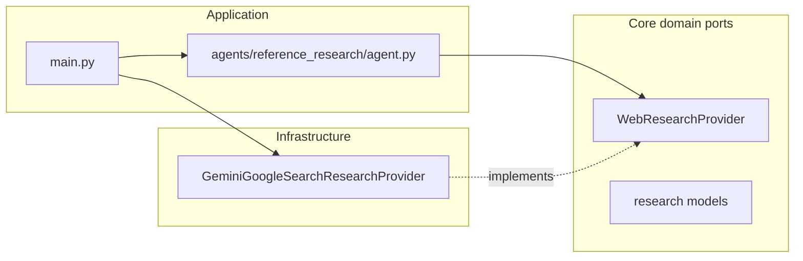

# Reference research agent (5 list/data URLs)

## Context from the repo

- Agents follow a consistent layout: [`agents/<agent_name>/`](agents/) with `agent.py` (orchestrator), `models.py` (config/result dataclasses), and `prompts.py` when LLM prompts are non-trivial (see [`agents/web_data_exporter/`](agents/web_data_exporter/) and [`agents/json_schema_transformer/`](agents/json_schema_transformer/)).
- [`main.py`](main.py) uses **late imports**, constructs concrete infrastructure (`GeminiProvider`, `SubprocessExecutor`, etc.), injects dependencies into the agent, and registers an **argparse subparser** per agent.
- [`core/llm/`](core/llm/) defines the generic [`LLMProvider`](core/llm/base.py) port; [`infrastructure/llm/gemini_provider.py`](infrastructure/llm/gemini_provider.py) implements plain `generate_content` **without** tools today.

For “research on the internet,” the most aligned approach with the existing stack ([`google-genai`](pyproject.toml)) is **Grounding with Google Search** (`types.Tool(google_search=types.GoogleSearch())` on `GenerateContentConfig`), which returns real sources in response metadata (see [Gemini: Grounding with Google Search](https://ai.google.dev/gemini-api/docs/google-search)). That satisfies the requirement better than a plain LLM call (which can hallucinate URLs).

## Clean architecture shape

- **New domain port** (no `google` imports): `core/research/` with an ABC (e.g. `WebResearchProvider`) plus small frozen dataclasses for `ResearchRequest`, `ResearchSource`, `ResearchResult`, and a `ResearchProviderError`—mirroring [`core/llm/base.py`](core/llm/base.py) style.
- **New infrastructure adapter**: `infrastructure/research/gemini_google_search_research.py` that owns the `genai.Client`, enables the Google Search tool, asks the model for **strict JSON**, and **extracts grounded URLs** from the SDK response (`candidates[0].grounding_metadata` / chunks—exact attribute traversal to be confirmed against the installed `google-genai` types during implementation).
- **Agent package** (application layer): `agents/reference_research/` with:
  - `models.py`: `ReferenceResearchConfig` (theme, optional output filename/path), `ReferenceResearchResult` (path + parsed sources).
  - `prompts.py`: system + user instructions emphasizing **comparison/list/numeric/table-friendly** pages, **exactly five** distinct `https` URLs, JSON-only output shape.
  - `agent.py`: `ReferenceResearchAgent` accepting `WebResearchProvider` in `__init__`, `run(config)` validates **len(sources) == 5**, URLs are **https**, **deduped**, and (when grounding metadata is present) each returned URL is **accounted for by grounding** to reduce hallucinations; writes JSON under [`output/`](output/) (same convention as other agents), with optional `--output` override.

## CLI wiring

- In [`main.py`](main.py): add subparser e.g. `reference-research` with:
  - `--theme` (required): free-text topic (e.g. “top coldest countries”, “curious facts about the sea”).
  - `--output` (optional): JSON filename or path; default derived from a slug of the theme (similar spirit to [`ExportConfig.derive_output_filename`](agents/web_data_exporter/models.py)).
- Runner function: instantiate `GeminiGoogleSearchResearchProvider`, inject into `ReferenceResearchAgent`, print human-readable summary + JSON path (consistent with existing agents’ UX).

## JSON output contract (for your video/article workflow)

A single JSON object, e.g.:

- `theme`: string (echo input)
- `sources`: array of 5 objects, each with at least:
  - `url`, `title`, `content_shape` (`list` | `table` | `data` | `mixed`), `rationale` (why it fits list/table/comparison research)

Parsing approach: same pragmatic pattern as [`WebDataExporterAgent._parse_analysis_response`](agents/web_data_exporter/agent.py) (strip optional markdown fences, `json.loads`, clear errors on invalid JSON).

## Operational notes (document briefly in [`README.md`](README.md) only if you want parity with other agents)

- Requires `GEMINI_API_KEY` (already used).
- Google Search grounding may have **model/API availability and billing** constraints per Google’s docs; the implementation should surface SDK errors as `ResearchProviderError` with actionable messages.
- If grounding returns fewer than five distinct grounded URLs, the agent should **fail fast with a clear message** (or a single bounded retry with a refined query—pick one; default recommendation: **one retry** then fail, to keep behavior predictable).

## Files to add / touch

| Area | Path                                                                                                                                                                                                 |
| ---- | ---------------------------------------------------------------------------------------------------------------------------------------------------------------------------------------------------- |
| New  | [`core/research/__init__.py`](core/research/__init__.py), [`core/research/base.py`](core/research/base.py), [`core/research/models.py`](core/research/models.py)                                     |
| New  | [`infrastructure/research/__init__.py`](infrastructure/research/__init__.py), [`infrastructure/research/gemini_google_search_research.py`](infrastructure/research/gemini_google_search_research.py) |
| New  | [`agents/reference_research/__init__.py`](agents/reference_research/__init__.py), `agent.py`, `models.py`, `prompts.py`                                                                              |
| Edit | [`main.py`](main.py) — subparser + runner                                                                                                                                                            |

No changes to [`core/llm/models.py`](core/llm/models.py) are strictly required if the research flow stays on the new port (keeps generic LLM generation decoupled from search tools).
