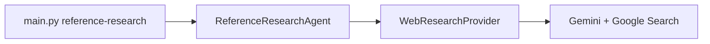
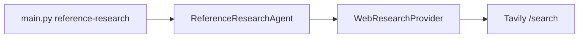

# Refactor reference research to Tavily API

## Current behavior

- [`main.py`](main.py) builds [`GeminiGoogleSearchResearchProvider`](infrastructure/research/gemini_google_search_research.py) and passes it to [`ReferenceResearchAgent`](agents/reference_research/agent.py).
- The provider calls Gemini with the Google Search tool, parses JSON `sources`, and sets `evidence_urls` from grounding metadata chunks.
- The agent retries once when `0 < len(evidence_urls) < 5`, then validates that each suggested URL is in the normalized evidence set when evidence is non-empty ([`agent.py`](agents/reference_research/agent.py) lines 68–133).

## Target behavior

- New provider: **`TavilyResearchProvider`** in a new file [`infrastructure/research/tavily_research.py`](infrastructure/research/tavily_research.py) (name can be `tavily_research.py` to match `gemini_google_search_research.py`).
- **HTTP**: `POST https://api.tavily.com/search` with JSON body (per [Tavily Search API](https://docs.tavily.com/documentation/api-reference/endpoint/search)): at minimum `api_key`, `query`, `max_results` (use **15–20** to improve odds of five distinct `https` URLs after filtering), `search_depth` (start with **`basic`** or **`fast`** for cost/latency balance; optionally use **`advanced`** on retry if the first call returns too few usable URLs).
- **Auth**: Read **`TAVILY_API_KEY`** from the environment (and optional constructor arg), mirroring the Gemini provider’s `GEMINI_API_KEY` pattern. If missing, raise **`ResearchProviderError`** with a clear message.
- **Mapping**:
  - Parse `results[]` (`title`, `url`, `content`, `score` if present).
  - Keep only **`https`** URLs (skip `http` so [`_validate_sources`](agents/reference_research/agent.py) does not fail on scheme).
  - Deduplicate with existing [`normalize_http_url`](core/research/urls.py).
  - **`evidence_urls`**: ordered distinct normalized URLs from **all** kept Tavily results (so the top five picks are always a subset when evidence is non-empty).
  - **`sources`**: take the **first five** distinct results (Tavily order is relevancy-ranked). Build `ResearchSource`: `title` from Tavily (fallback to URL), `rationale` from truncated `content` (e.g. ~400–600 chars), `content_shape` default **`"mixed"`** with a tiny optional heuristic (`table` / `list` / `data` keywords in title+content) if you want slightly richer output without an LLM.
- **Errors**: Map non-2xx / network failures to **`ResearchProviderError`** with response body snippet when safe (similar spirit to Gemini provider’s try/except).

## Domain model tweak (retry without breaking Gemini)

Today the agent’s “retry” swaps in [`build_retry_user_prompt(theme)`](agents/reference_research/prompts.py), which is long LLM-oriented text — **poor as a Tavily `query`**.

- Add an optional field to [`ResearchRequest`](core/research/models.py), e.g. **`search_query: str | None = None`**, documented as an optional retrieval query override (Tavily uses it; Gemini can ignore it).
- **First call**: `search_query=None` — Tavily provider uses a **short composed query** from `theme` (e.g. `f"{theme} ranked list statistics table data"` defined in [`agents/reference_research/prompts.py`](agents/reference_research/prompts.py) as `build_tavily_query(theme)`).
- **Retry call**: pass `search_query=build_tavily_retry_query(theme)` (another short broad query, e.g. adds synonyms / “Wikipedia list” / “world bank” style hints without multi-paragraph instructions).
- [`GeminiGoogleSearchResearchProvider`](infrastructure/research/gemini_google_search_research.py) needs **no logic change** beyond accepting the new dataclass field (default `None`).

## Agent and prompts

- Update [`agents/reference_research/agent.py`](agents/reference_research/agent.py):
  - Pass `search_query` on the retry `ResearchRequest` as above.
  - Replace user-facing / log strings that say **“Google Search grounding”** with neutral wording (**“Tavily search”** or **“retrieval”**) in warnings and [`ResearchProviderError`](core/research/base.py) messages (lines 91–96, 127–132).
- Update [`agents/reference_research/prompts.py`](agents/reference_research/prompts.py):
  - Add **`build_tavily_query`** / **`build_tavily_retry_query`**.
  - Either **remove** the old Gemini-specific `SYSTEM_INSTRUCTION` / `build_user_prompt` / `build_retry_user_prompt` if nothing references them, **or** keep `build_user_prompt` / `build_retry_user_prompt` only for the Gemini provider path. Recommended: **keep Gemini-oriented prompts** in the same file for [`GeminiGoogleSearchResearchProvider`](infrastructure/research/gemini_google_search_research.py) unchanged, and add the two Tavily query helpers; the agent continues to pass the long prompts for Gemini compatibility if you ever switch the CLI back. If the CLI is **Tavily-only**, the agent can pass **minimal** `system_instruction` / `user_prompt` for the first request (Gemini ignores are unnecessary for Tavily) — simplest is **empty strings** or one-line placeholders so `ResearchRequest` stays valid without maintaining two parallel prompt sets for an unused provider.

**Pragmatic choice for this refactor**: Wire CLI to Tavily only; in the agent, use **empty `system_instruction` and `user_prompt`** on both calls (Tavily ignores them) and rely on **`theme` + `search_query`** for retrieval. **Remove** unused `SYSTEM_INSTRUCTION` / `build_user_prompt` / `build_retry_user_prompt` **only if** you confirm Gemini provider is not used by reference-research anymore — otherwise keep those strings for [`gemini_google_search_research.py`](infrastructure/research/gemini_google_search_research.py) tests/manual use. Cleanest split: **keep** the JSON-oriented system/user strings in `prompts.py` for the Gemini provider file’s future use, but **stop importing them from the agent** when the CLI uses Tavily only (avoids dead imports in the agent).

## Wiring and exports

- [`main.py`](main.py) `run_reference_research`: import and construct **`TavilyResearchProvider`** instead of `GeminiGoogleSearchResearchProvider`.
- [`infrastructure/research/__init__.py`](infrastructure/research/__init__.py): export the new class alongside the Gemini provider (or only Tavily if you want a minimal public API — exporting both is friendlier for reuse).

## Docs

- [`README.md`](README.md): Update the reference-research section to describe **Tavily** and **`TAVILY_API_KEY`** (and remove or soften Gemini / Google Search grounding as the mechanism for this command).

## Dependencies

- **No new packages**: use existing **`httpx`** ([`pyproject.toml`](pyproject.toml)) consistent with [`agents/web_data_exporter/html_downloader.py`](agents/web_data_exporter/html_downloader.py) (`httpx.Client`, timeouts, `raise_for_status()` where appropriate).

## Verification (after implementation)

- `uv run python main.py reference-research --theme "..."` with `TAVILY_API_KEY` set in `.env`.
- Confirm output JSON still has five distinct `https` sources and the CLI prints titles/URLs.
