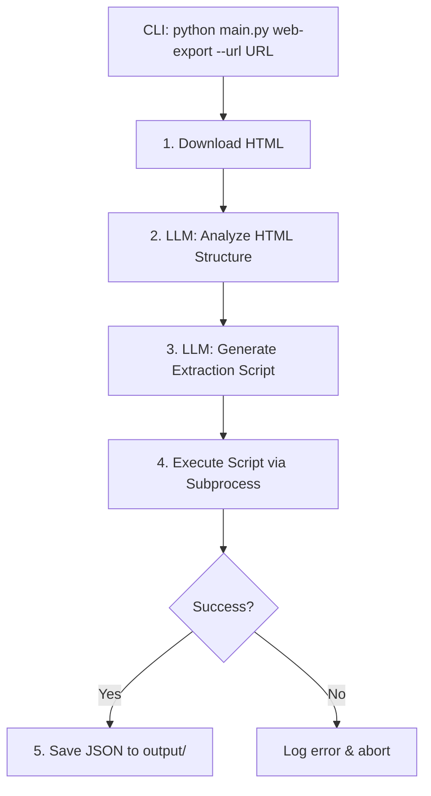

# Web Data Exporter Agent — Implementation Plan

Build the first AI agent that downloads a web page, analyzes its structure, generates a Python extraction script, executes it, and produces a structured JSON file.

## User Review Required

> [!IMPORTANT]
> **Script Execution Strategy**: For Step 3 (running the generated Python script), I recommend using **Python `subprocess`** with a timeout and input validation rather than a full MCP server. MCP adds significant complexity for an MVP. The executor will be abstracted behind an interface, so you can swap to MCP later. **Do you agree with this approach?**

> [!IMPORTANT]
> **Gemini Model Choice**: I'll use `gemini-2.5-flash` for both the analysis and code generation steps. It's fast and cost-effective. Would you prefer a different model (e.g., `gemini-2.5-pro`) for the code generation step?

> [!WARNING]
> **Safety**: The agent generates and executes Python code from LLM output. For the MVP, I'll run it via subprocess with a 60-second timeout. No Docker/sandboxing is planned for now. The generated scripts will only have access to the local filesystem (reading the downloaded HTML, writing the JSON output).

---

## Architecture Overview

```
kingdom-ai-agents/
├── main.py                         # CLI entrypoint (argparse, agent selection)
├── pyproject.toml
│
├── core/                           # Domain layer (no external dependencies)
│   ├── __init__.py
│   ├── llm/
│   │   ├── __init__.py
│   │   ├── base.py                 # Abstract LLMProvider interface
│   │   └── models.py               # LLMRequest, LLMResponse dataclasses
│   └── executor/
│       ├── __init__.py
│       └── base.py                 # Abstract ScriptExecutor interface
│
├── infrastructure/                 # Concrete implementations
│   ├── __init__.py
│   ├── llm/
│   │   ├── __init__.py
│   │   └── gemini_provider.py      # Google Gemini implementation
│   └── executor/
│       ├── __init__.py
│       └── subprocess_executor.py  # Subprocess-based script runner
│
├── agents/                         # Individual agents
│   ├── __init__.py
│   └── web_data_exporter/
│       ├── __init__.py
│       ├── agent.py                # Main orchestrator (pipeline)
│       ├── prompts.py              # All LLM prompts
│       ├── html_downloader.py      # Fetch & save HTML
│       └── models.py               # Agent-specific data models
│
├── output/                         # Generated JSON output files
│   └── .gitkeep
│
└── workspace/                      # Temp workspace for downloaded HTML & generated scripts
    └── .gitkeep
```

### Key Design Decisions

| Decision | Rationale |
|:---|:---|
| **Abstract `LLMProvider`** | Makes model provider swappable (Gemini → Claude, etc.) |
| **Abstract `ScriptExecutor`** | Makes execution strategy swappable (subprocess → MCP → Docker) |
| **Agents in separate folders** | Each agent is self-contained; easy to add more agents |
| **Prompts in dedicated file** | Keeps prompt engineering separate from logic |
| **Workspace directory** | Temp storage for HTML files and generated scripts |

---

## Proposed Changes

### Core Domain Layer

#### [NEW] [base.py](file:///home/angelo-marques/projects/personal/kingdom-ai-agents/core/llm/base.py)
Abstract base class `LLMProvider` with method:
- `generate(prompt: str, system_instruction: str | None) -> str`

#### [NEW] [models.py](file:///home/angelo-marques/projects/personal/kingdom-ai-agents/core/llm/models.py)
Dataclasses: `LLMRequest` (prompt, system_instruction, model) and `LLMResponse` (text, usage metadata).

#### [NEW] [base.py](file:///home/angelo-marques/projects/personal/kingdom-ai-agents/core/executor/base.py)
Abstract base class `ScriptExecutor` with method:
- `execute(script_path: Path, args: list[str]) -> ExecutionResult`
- `ExecutionResult` dataclass with `stdout`, `stderr`, `success`, `return_code`

---

### Infrastructure Layer

#### [NEW] [gemini_provider.py](file:///home/angelo-marques/projects/personal/kingdom-ai-agents/infrastructure/llm/gemini_provider.py)
Concrete `GeminiProvider(LLMProvider)`:
- Uses `google-genai` SDK
- Reads `GEMINI_API_KEY` from environment
- Configurable model name (default: `gemini-2.5-flash`)

#### [NEW] [subprocess_executor.py](file:///home/angelo-marques/projects/personal/kingdom-ai-agents/infrastructure/executor/subprocess_executor.py)
Concrete `SubprocessExecutor(ScriptExecutor)`:
- Runs generated Python scripts via `subprocess.run`
- 60-second timeout
- Captures stdout/stderr
- Returns `ExecutionResult`

---

### Web Data Exporter Agent

#### [NEW] [agent.py](file:///home/angelo-marques/projects/personal/kingdom-ai-agents/agents/web_data_exporter/agent.py)
Main orchestrator `WebDataExporterAgent` with pipeline:

```
Step 1: download_html(url) → saves HTML to workspace/
Step 2: analyze_html(html_content) → LLM determines data strategy
Step 3: generate_script(html_content, analysis) → LLM writes Python extraction script
Step 4: execute_script(script_path) → Runs script via ScriptExecutor
Step 5: save_output() → Copies JSON result to output/
```

#### [NEW] [prompts.py](file:///home/angelo-marques/projects/personal/kingdom-ai-agents/agents/web_data_exporter/prompts.py)
Two main prompts:
1. **Analysis Prompt**: Examines HTML structure, identifies data layout (table vs. article sections), determines columns/fields
2. **Script Generation Prompt**: Given the HTML and analysis, generates a Python script using `BeautifulSoup` to parse and extract structured data to JSON

#### [NEW] [html_downloader.py](file:///home/angelo-marques/projects/personal/kingdom-ai-agents/agents/web_data_exporter/html_downloader.py)
Simple HTTP downloader:
- Uses `httpx` (async-ready, modern) or `requests`
- Saves raw HTML to `workspace/{sanitized_filename}.html`
- Handles common HTTP errors

#### [NEW] [models.py](file:///home/angelo-marques/projects/personal/kingdom-ai-agents/agents/web_data_exporter/models.py)
Agent-specific dataclasses:
- `ExportConfig` (url, output_filename)
- `AnalysisResult` (data_type: table|sections, columns, strategy_description)
- `ExportResult` (json_path, record_count, columns)

---

### Entry Point

#### [MODIFY] [main.py](file:///home/angelo-marques/projects/personal/kingdom-ai-agents/main.py)
- Add `argparse` CLI with subcommands per agent
- `python main.py web-export --url "https://..." --output "capitals.json"`
- Wire up dependency injection (create provider, executor, pass to agent)

#### [MODIFY] [pyproject.toml](file:///home/angelo-marques/projects/personal/kingdom-ai-agents/pyproject.toml)
Add dependencies:
- `httpx` — HTTP client for downloading HTML
- `beautifulsoup4` — Used by generated scripts for HTML parsing (must be installed)
- `python-dotenv` — Load `.env` file for API keys

---

## Pipeline Flow



## Open Questions

> [!IMPORTANT]
> 1. **Subprocess vs MCP**: Should I go with simple subprocess for the MVP, or do you want a full MCP server from the start?
> 2. **Gemini Model**: `gemini-2.5-flash` for both steps, or a more powerful model for code generation?
> 3. **HTTP Client**: `httpx` (modern, async-capable) or `requests` (simpler)?
> 4. **Output naming**: Should the JSON filename be auto-derived from the URL, or always specified via CLI flag?

## Verification Plan

### Automated Tests
- Run the agent against a known URL (e.g., Wikipedia "List of capital cities by elevation")
- Verify the output JSON contains the expected columns and record count
- Test error handling (invalid URL, timeout, bad HTML)

### Manual Verification
- Inspect the generated extraction script for correctness
- Validate JSON output structure matches the source data
- Test with different page types (table-based vs. article-based)
